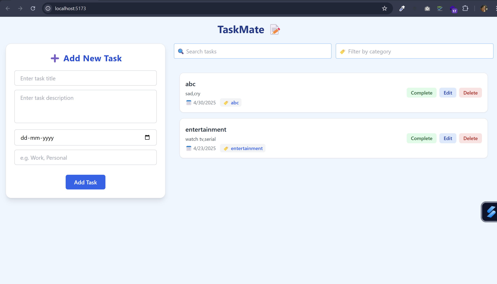

# 📝 TaskMate

TaskMate is a sleek and responsive task management application built using **React**, **Tailwind CSS**, and a **Node.js + Express** backend with **MongoDB**. It allows users to manage daily tasks efficiently with features like task creation, editing, filtering, category tagging, due dates, and completion toggling.

---

## 🚀 Features

- ✅ Add, edit, delete, and toggle tasks
- 🏷️ Assign categories to tasks
- 📅 Set and view due dates
- 🔍 Search and filter tasks
- 🎨 Responsive and clean UI using Tailwind CSS
- 💾 Persisted data using MongoDB
- 📡 Full backend integration using Express and Axios

---

## 🛠️ Tech Stack

**Frontend:**
- React
- Tailwind CSS
- Axios

**Backend:**
- Node.js
- Express.js
- MongoDB
- Mongoose

---

## 📸 Preview

> 

---

## 🧑‍💻 Installation & Setup

### 1. Clone the repository
```bash
git clone https://github.com/your-username/taskmate.git
cd taskmate
